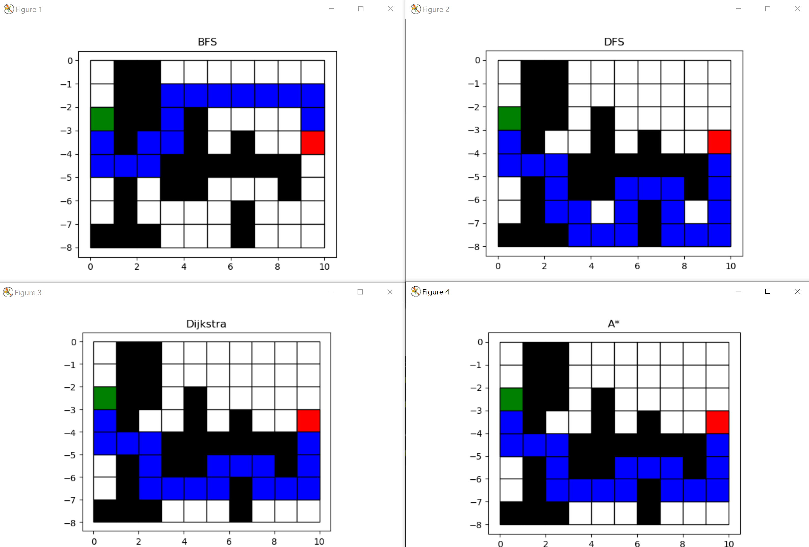
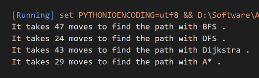

# Basic Search Algorithms

4 basic search algorithms, DFS, BFS, Dijkstra and A* are implemented.

### Result

### Result explanation

#### DFS

DFS always expands the newest neighbor nodes first. As shown in the figure, it takes the most moves, exploring all the closest neighbors until finding the goal.

#### BFS

BFS always expands the closest neighbor nodes first. In this implementation, it always tries to go down first, then right, left, up. As shown in the figure, it takes the less moves to find the goal, but the path is not optimal.

#### Dijkstra

The Exploring order of Dijkstra is decided by the cost function, which in Dijkstra case, equals to cost to come. To make the result a bit different. The cost to move (weight) of the upper map is set to be 0.5 higher than the other part. As shown in the figure, the path avoids the upper part of the map but choose a lower path even though it is longer in grid sense.

#### A* 

The Exploring order of A* is decided by the cost function, which in A* case, equals to the sum of cost to come and heuristic. The same path as the Dijkstra's one is found as it is the optimal path. However, it takes only 29 moves, much less than 43 moves of Dijkstra, to find this path with the guide of heuristic.

### Code Structure

Two classes are implemented in this code, one is `Node` containing all the needed variable of a small grid and the other is `Maze` containing the properties of a map and a matrix of `Node`s. Though the algorithms vary, the search step is very similar to each other, which therefore are all written in one method `search(self, search_algo)` .

`search(self, search_algo)` keeps taking the first node from the `queue  ` and expanding, adding allowed neighbor nodes to the `queue`. The search stops when the goal is found or the `queue` is empty, in which case, no path exists.

The major difference is how to put these new nodes in the queue and how to sort them.

**DFS** does not use cost function. The new nodes are put to the end of the queue without sorting.

**BFS** does not use cost function, either. The nodes are put in the beginning of the queue without sorting.

**Dijkstra** has a cost function equaling to the cost to come. If the new node is already in the queue, it should be less costly to be able to replace the already existed node. After putting the new node into the queue, the queue is sorted according to the cost function.

**A*** has a cost function equaling to the sum of cost to come and heuristic. If the new node is already in the queue, it should be less costly to be able to replace the already existed node. After putting the new node into the queue, the queue is sorted according to the cost function.

